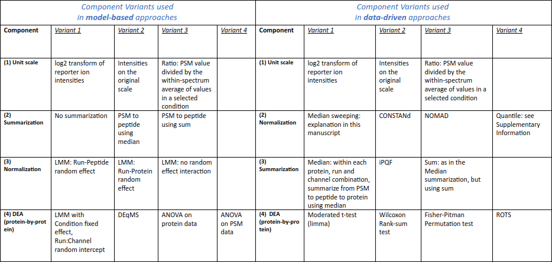

<style>body {text-align: justify}</style>

```{r, libraries, message=FALSE, echo=FALSE, warning=FALSE}
library(tidyverse)
library(ggplot2)
library(stringi)
library(venn)
library(kableExtra)
```

# Introduction

In this notebook series, we explore how different data analysis strategies affect the outcome of a proteomics experiment based on isobaric labeling and mass spectrometry.
Each analysis strategy or 'workflow' can be divided up into different components.
In this notebook specifically, we give an overview of the different workflow components and briefly describe the data set used.

There is quite some complexity and experimental variability involved due to the isobaric labeling and pooling of samples and combining of data from different instrument runs, respectively. To make matters worse, LC-MS/MS data is already quite hierarchical in nature. If you need a refresher on any of this, expand the next paragraph.

<details>
  <summary>Structure of isobarically labeled LC-MS/MS proteomics data.</summary>
  A labeling approach enables the bottom-up analysis of multiple biological samples simultaneously within a single tandem-MS run. In isobaric labeling (e.g. TMT labels in Figure 1), there is no mass difference between signals of identical peptides, which further increases the comparability and quality of the signals, in this case represented by the reporter fragment ion intensities.
```{r f:tmtlabels, echo=FALSE, fig.align="center", out.width = "100%", fig.cap="Figure 1: a) TMT 6-plex labels differ by isotopes (*) only. b) The reactive group binds to the amino-terminus of the peptides, the reporter breaks off during fragmentation and the mass normalizer/balancer guarantees that the intact labels are isobaric. Image source: [Rosenblatt et al.](https://assets.fishersci.com/TFS-Assets/BID/posters/D00337~.pdf)."}
knitr::include_graphics("tmt.png")
```
  Even though the reporters allow one to assign each spectrum to the correct sample, there is still a substantial amount of complexity to be dealt with. The figure below shows how each protein may be represented by many peptides, multiple times, in multiple 'shapes and forms'. This is why summarization and normalization steps are key components in every workflow.
```{r f:data_hierarchy, echo=FALSE, fig.align="center", out.width = "100%", fig.cap="Figure 2: Tandem-MS data is complex and hierarchical; many different signals compete in determining the (relative) abundance of a protein . The latter are not measured directly, but are represented in possibly multiple runs as multiple variations of multiple peptides in different conditions and different (usually replicate) samples. Many different combinations of such signals co-exist and some are measured in each LC-MS run, while some are not (e.g.: peptide k is not measured in the rightmost run). RT=retention time, CS=charge state, PTM=post-translational modification."}
knitr::include_graphics("data_hierarchy.png")
```
</details>  

# Workflow components

The table below shows an overview of the many components that make up a workflow for performing a differential expression analysis (DEA). This list is probably not exhaustive, but for each of those components a decision has to be made.
Note that we have made a distinction between data-driven and model-based approaches, which refers to the type of normalization method they use.
<!-- use tablesgenerator.com OR the image below... -->
```{r f:table_selected_variants, echo=FALSE, fig.align="center", out.width = "100%", fig.cap="Figure 3: An overview of our selected components and component variants for constructing an analysis workflow. When studying a particular component (e.g. data-driven normalization), each component variant (e.g. median sweeping, CONSTANd, ...) is applied to the data, while the other workflow components are executed using 'Variant 1' methods only. The same process applies when studying the other components (e.g. summarization), overall, leading to multiple sets of outcomes."}

```

Each of the notebooks in this series takes the default approach, except for one component for which different variants are explored in detail. We chose the **unit scale**, **normalization method**, **summarization method** and **DEA method** as most interesting components to investigate, because on one hand we expect them to be impactful and on the other hand they are the ones we see varied and published about the most. We have made a non-systematic, non-exhaustive, [publicly available list of publications and software packages](https://docs.google.com/document/d/14BeNQFh3KHiKESdoF5A4OUlo9QWmt9kv/edit) related to analyzing proteomics data. You are very welcome to suggest edits and additions to this public repository.

# Data set

The data used in this notebook series is a subset of the SpikeIn-5mix-MS2 (Five controlled mixtures with technical replicates) data set used in [Ting et al.](https://doi.org/10.1074/mcp.RA120.002105) for [MSstatsTMT](http://msstats.org/msstatstmt/).
It contains a HeLa background with 48 UPS1 proteins spiked in as a dilution series, which will also constitute the nomenclature for our biological conditions: 1, 0.667, 0.5, and 0.125 times of the highest UPS1 peptide amount (500 fmol).
As shown in the figure below, we use only Runs 1, 2, 4, 5, which represent the first two technical replicates of the first two biological replicates (mixtures). Further, we do not use the reference channels because a) we wish to demonstrate how to analyze data sets _without_ the use of internal references; and b) we wish to avoid confusion with reference conditions and/or channels in the context of ratio's and fold changes.

```{r f:design_ILS_as_subset, echo=FALSE, fig.align="center", out.width = "100%", fig.cap="Figure 4: We use only the subset (red rectangle) of data from the original study that consists of channels 127N through 130C (omitting the Reference condition samples) in Runs 1,2,4,5 with Mixtures 1 and 2. We also applied several data filtering steps - detailed in the 'Arbitrary choices for the other components' subsection above - after which we were left with 58 028 PSMs, 26 921 unique peptides and 4083 unique proteins, containing 19 out of the 48 spiked-in proteins. Image adapted from [Ting et al.](https://doi.org/10.1074/mcp.ra120.002105)"}
knitr::include_graphics("design_ILS_as_subset.png")
```

We use the following settings _whenever applicable_ for calculating values or generating figures:

- the reference condition is '0.5';
- the example ratio for sample comparisons is 'Run4_127C' / 'Run2_129N' (a.k.a. 'Mixture2_1:127C' / 'Mixture1_2:129N');
- the example ratio for condition comparisons is '0.125' / '0.5';
- in multi-color figures, the color coding is:
```{r, echo=FALSE, results='asis', align='center'} 
df <- data.frame(Condition=c("0.125", "0.5", "0.667", "1"), Color=c('black', 'blue', 'green', 'red'))
knitr::kable(df) %>% kable_styling(full_width = F)
```


## Filtering and preparation

In the file `data_prep.R` you can find the details of all data preparation steps. Here, we list which PSMs were discarded or modified and why:
1. Use only data from Runs 1, 2, 4, 5.
1. Discard reference samples (TMT channels 126 and 131).
1. Discard PSMs with shared peptides (as done in [Ting et al.](https://doi.org/10.1074/mcp.RA120.002105)).
1. Add simulated variability (see next section).
1. Reconstruct missing MS1 Intensity column based on MS2 intensities (necessary for some component variants).
1. Discard duplicate PSMs due to the use of multiple search engine instances (which only change the score).
1. Discard PSMs of proteins that appear both in the background and spike-in.
1. Discard PSMs with Isolation Interference (%) > 30.
1. Discard PSMs with NA entries in the quantification channels.
1. Discard PSMs of one-hit-wonder proteins.

## Simulated biological variability

This experiment was carried out so carefully that the protein concentrations, i.e., the sample sizes, are all very close to each other. In principle this is good, but we actually want to thoroughly test different normalization methods, and specifically their ability to correct for different sample sizes.
Therefore, in `data_prep.R` we introduced additional, random variation by multiplying all quantification values in each sample by 2^r, where r is a random number drawn from a normal distribution with mean zero and standard deviation 0.2 (this value was also used by [Ting et al.](https://doi.org/10.1074/mcp.RA120.002105)).

## Explore data

This is what the data looks like (in wide format):

```{r kable, echo=FALSE, results = "asis"}
#if (!exists('params')) params <- list(input_data_p='input_data.Rds', suffix_p='msstatstmt', load_outputdata_p=FALSE, subsample_p=0)
data.list <- readRDS(params$input_data_p)  # create symlink
dat.l <- data.list$dat.l
dat.w <- data.list$dat.w
display_dataframe_head(dat.w)
```

The rest of this section calculates some interesting characteristics and informative graphs:

```{r, warning=FALSE, message=FALSE, class.source = "fold-show"}
# number of detected proteins
(n.protein <- length(unique(dat.w$Protein))) 
# number of detected pepides
(n.peptide <- length(unique(dat.w$Peptide))) 
# number of recorded spectra
(n.spectra <- nrow(dat.w)) 
  
# median number of peptides per protein
dat.w %>% group_by(Protein) %>% summarize(ndist=n_distinct(Peptide)) %>% mutate(n.protein.mean=median(ndist)) %>% pull(n.protein.mean) %>% unique

# median number of PSMs per peptide
dat.w %>% group_by(Peptide) %>% summarize(ndist=n()) %>% mutate(n.peptide.med=median(ndist)) %>%
  pull(n.peptide.med) %>% unique

# number of 'peptides within run' instances 
# (i.e. one peptide across multiple runs is counted as multiple separate entitities)
(dc1 <- dat.w %>% distinct(Run, Peptide) %>% nrow) 

dc2 <- dat.w %>% group_by(Run, Peptide) %>% 
  summarize(ndist=n()) %>% 
  filter(ndist>1)
dc2 %>% nrow # 'peptides within run' instances detected in >1 spectra

# distribution of PSM counts per 'peptides within run' (counts > 1)
table(dc2$ndist)
# histogram of PSM counts per 'peptides within run' (counts > 1; removed 5 outliers)
hist(dc2$ndist[dc2$ndist<12], breaks=0.5+1:11, main="PSM counts per 'peptides within run'", xlab='PSM counts per peptide')

# percentage of duplicates on PSM level
100*nrow(dc2)/dc1

# 'peptides within run' instances eluted over multiple retention times
dc3 <- dat.w %>% group_by(Run, Peptide) %>% 
  summarize(RT.dist=n_distinct(RT)) %>% 
  filter(RT.dist>1) 
dc3 %>% nrow 

# RT is the cause of 99% of PSM duplicates
100*(dc3 %>% nrow/dc2 %>% nrow)
```


```{r, warning=FALSE, message=FALSE, echo=FALSE, class.source = "fold-show"}
if (FALSE) { #+ already removed in data_prep.R
  # number of spectra with isolation interference>30%
  dat.w %>% filter(isoInterOk=='N') %>% nrow 
  
  # number of spectra with at least one missing quantification channel
  dat.w %>% filter(noNAs=='N') %>% nrow 
  
  # number of proteins represented by one peptide only 
  dat.w %>% filter(onehit.protein=='Y') %>% distinct(Protein) %>% nrow
  
  # number of shared peptides
  dat.w %>% filter(shared.peptide=='Y') %>% distinct(Peptide) %>% nrow
  
  # number of spectra after filtering out spectra wth iso interference >30% or with >1 missing quan channel
  dat.tmp <- dat.w %>% filter(isoInterOk=='Y' & noNAs=='Y')
  nrow(dat.tmp)
  
  # reduction in number of spectra
  nrow(dat.w)-nrow(dat.tmp)
} #- already removed in data_prep.R
```


```{r, warning=FALSE, message=FALSE, class.source = "fold-show"}
# Venn diagram of proteins identified  across MS runs
unique.prot <- dat.w %>% group_by(Run) %>% distinct(Protein) %>% mutate(val=1)
unique.prot <- unique.prot %>% pivot_wider(Protein, names_from='Run', values_from='val', values_fill=0)
venn(unique.prot[, -1], zcolor = "style", main='Proteins')

# Venn diagram of peptides identified  across MS runs
unique.pep <- dat.w %>% group_by(Run) %>% distinct(Peptide) %>% mutate(val=1)
unique.pep <- unique.pep %>% pivot_wider(Peptide, names_from='Run', values_from='val', values_fill=0)
venn(unique.pep[, -1], zcolor = "style", main='Peptides')

# names of remaining spiked-in proteins
(sp <- dat.w %>% distinct(Protein) %>% filter(stri_detect(Protein, fixed='ups')) %>% pull %>% as.character)

# number of spiked-in proteins remaining (out of 48) after filtering
length(sp)
```


