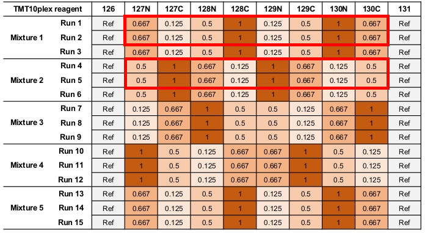

```{r, libraries, message=FALSE, echo=FALSE, warning=FALSE}
library(tidyverse)
library(ggplot2)
library(stringi)
library(venn)
```

# General intro
*The text below is just a quick and dirty sketch of the future content*

In this notebook series, we explore how different data analysis strategies affect the outcome of a proteomics experiment based on isobaric labeling and mass spectrometry.
Each analysis strategy or 'workflow' can be divided up into different components.
In this notebook specifically, we give an overview of the different workflow components and briefly describe the data set used.

Analyzing this kind of data is not a simple matter, because there is quite some complexity and experimental variability involved due to the pooling of samples and combining of data from different intrument runs, respectively. On top of that, the data is also quite hierarchical in nature. 

<details>
  <summary>If you need a refresher on any of those, expand this section.</summary>
  _stuff about proteins, sample pooling, and the large amount of variability between MS runs (as opposed to, e.g. NGS data. You can copy that info from this paper: https://drive.google.com/file/d/1TE_2e_tWsIU5fNtPpIwN7CjJsetgPqP5/view?usp=sharing)_
</details>  

# Workflow components

The table below shows an overview of the many components that make up a workflow for performing a differential expression analysis (DEA). This list is probably not exhaustive, but for each of those components a decision has to be made.
Note that we have made a dichotomy between data-driven and model-based approaches.

<!-- use tablesgenerator.com OR the image below... -->


Each of the notebooks in this series takes the default approach, except for one component for which different variants are explored in detail. We chose the **unit scale**, **normalization method**, **summarization method** and **DEA method** as most interesting components to investigate, because on one hand we expect them to be impactful and on the other hand they are the ones we see varied and published about the most. We have made a non-systematic, non-exhaustive, [publicly available list of publications and software packages](https://docs.google.com/spreadsheets/d/1P6yCwUPVIxLb6w3oHiH-xptKBXe_17D_KUkBbLJ6p4w/edit?pli=1#gid=0) related to analyzing proteomics data. You are very welcome to suggest edits and additions to this public repository.

# Data set

The data used in this notebook series is a subset of the SpikeIn-5mix-MS2 (Five controlled mixtures with technical replicates) data set used in the initial [publication](https://doi.org/10.1074/mcp.RA120.002105) on [MSstatsTMT](http://msstats.org/msstatstmt/).
As shown in the figure below, we use only ............subsetting to mixtures 1,2 and techreps 1,2



Below the first few records of the data (in wide format) are printed out to see what we will be dealing with.

- DATA WAS FILTERED IN data_prep.R: Mention potential filtering steps (PSM engine redundancy, dropping reference channels, SMs with missing values, isolation interference>30%, shared peptides, one-hit wonders) and their impact on # of PSMS and intensity distributions.  

```{r, echo=FALSE}
data.list <- readRDS(params$input_data_p)  # create symlink
dat.l <- data.list$dat.l
dat.w <- data.list$dat.w
head(dat.w)
```

Some data characteristics:
```{r, warning=FALSE, message=FALSE}
(n.protein <- length(unique(dat.w$Protein))) # number of detected proteins
(n.peptide <- length(unique(dat.w$Peptide))) # number of detected pepides
(n.spectra <- nrow(dat.w)) # number of recorded spectra
  
# median # of peptides per protein
dat.w %>% group_by(Protein) %>% summarize(ndist=n_distinct(Peptide)) %>% mutate(n.protein.mean=median(ndist)) %>% pull(n.protein.mean) %>% unique

# median # of PSMs per peptide
dat.w %>% group_by(Peptide) %>% summarize(ndist=n()) %>% mutate(n.peptide.med=median(ndist)) %>%
  pull(n.peptide.med) %>% unique

# how many 'peptides within run' instances 
# (i.e. one peptide across multiple runs is treated as a separate entitity)
(dc1 <- dat.w %>% distinct(Run, Peptide) %>% nrow) 

dc2 <- dat.w %>% group_by(Run, Peptide) %>% 
  summarize(ndist=n()) %>% 
  filter(ndist>1)
dc2 %>% nrow # 'peptides within run' instances detected in >1 spectra

# distribution of PSM counts per 'peptides within run' (counts >1)
table(dc2$ndist)
hist(dc2$ndist, breaks=10, main="PSM counts per 'peptides within run'", xlab='PSM counts per peptide')

# percentage of duplicates on PSM level
100*nrow(dc2)/dc1

# 'peptides within run' instances eluted over multiple retention times
dc3 <- dat.w %>% group_by(Run, Peptide) %>% 
  summarize(RT.dist=n_distinct(RT)) %>% 
  filter(RT.dist>1) 
dc3 %>% nrow 

# RT is the cause of 99% of PSM duplicates
100*(dc3 %>% nrow/dc2 %>% nrow) 

# number of spectra with isolation interference>30%
dat.w %>% filter(isoInterOk=='N') %>% nrow 

# number of spectra with at least one missing quantification channel
dat.w %>% filter(noNAs=='N') %>% nrow 

# number of proteins represented by one peptide only 
dat.w %>% filter(onehit.protein=='Y') %>% distinct(Protein) %>% nrow

# number of shared peptides
dat.w %>% filter(shared.peptide=='Y') %>% distinct(Peptide) %>% nrow

# number of spectra after filtering out spectra wth iso interference >30% or with >1 missing quan channel
dat.tmp <- dat.w %>% filter(isoInterOk=='Y' & noNAs=='Y')
nrow(dat.tmp)

# reduction in # of spectra
nrow(dat.w)-nrow(dat.tmp)

# Venn diagram of proteins identified  across MS runs
unique.prot=dat.w %>% 
  group_by(Run) %>%
  distinct(Protein) %>% 
  mutate(val=1)
unique.prot <- unique.prot %>% pivot_wider(Protein, names_from='Run', values_from='val', values_fill=0)
venn(unique.prot[, -1], zcolor = "style", main='Proteins')

# Venn diagram of peptides identified  across MS runs
unique.pep=dat.w %>% 
  group_by(Run) %>%
  distinct(Peptide) %>% 
  mutate(val=1)
unique.pep <- unique.pep %>% pivot_wider(Peptide, names_from='Run', values_from='val', values_fill=0)
venn(unique.pep[, -1], zcolor = "style", main='Peptides')

# names of spiked-in proteins
(sp <- dat.tmp %>% distinct(Protein) %>% filter(stri_detect(Protein, fixed='ups')) %>% pull %>% as.character)

# number of spiked-in proteins
length(sp)
```


